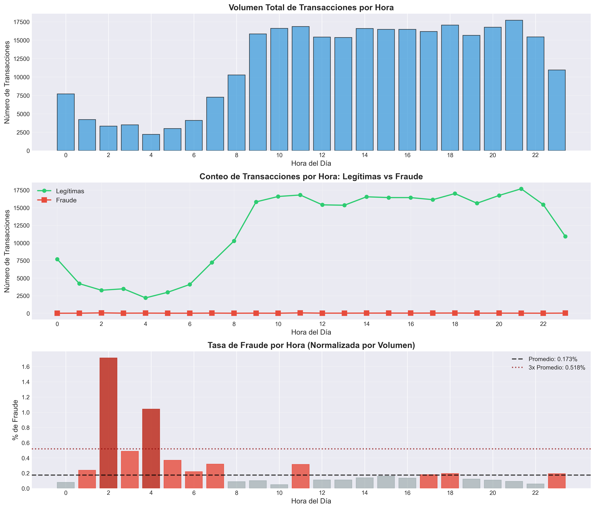
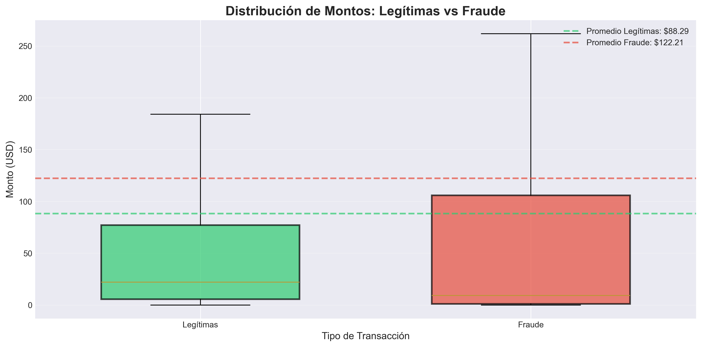
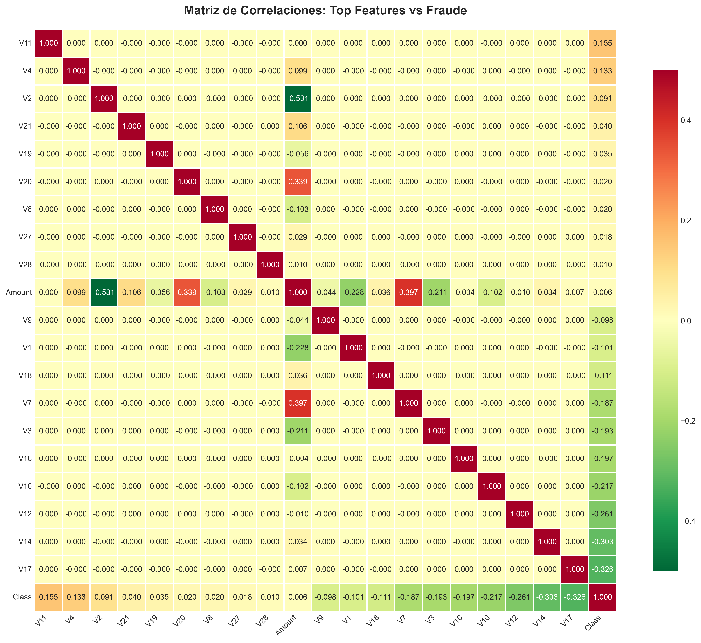
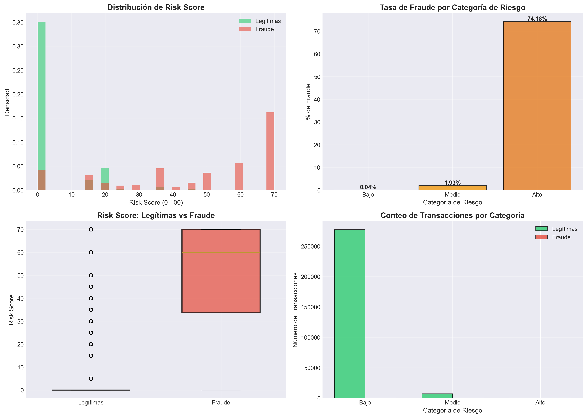

## Objetivo

Desarrollar un sistema de scoring de riesgo para identificar transacciones fraudulentas con tarjetas de crédito en tiempo real, reduciendo pérdidas financieras en un 27-45% mediante reconocimiento de patrones y detección de anomalías.

---

## Dataset

- **Fuente:** Kaggle - Credit Card Fraud Detection (Tarjetahabientes europeos, 2013)
- **Tamaño:** 284,807 transacciones en 48 horas
- **Variables:** 31 (Time, V1-V28 componentes PCA, Amount, Class)
- **Desafío:** Dataset altamente desbalanceado (99.83% legítimas, 0.17% fraude)

### Definición de Variables

**Variables Originales:**
- **Time:** Segundos transcurridos desde la primera transacción (0-172,792s = 48 horas)
- **Amount:** Monto de la transacción en USD ($0-$25,691)
- **Class:** Variable objetivo (0 = Legítima, 1 = Fraude)

**Variables Anónimas (PCA):**
- **V1-V28:** 28 componentes principales de transformación PCA
  - Protege datos sensibles (números de tarjeta, nombres, etc.)
  - Mantiene poder predictivo mientras asegura privacidad
  - Normalizadas (media ≈ 0, desviación estándar ≈ 1)

**Variables Derivadas:**
- **Hour:** Hora del día extraída de Time (0-23)
- **Risk_Score:** Puntuación de riesgo calculada (0-100) basada en patrones temporales y características
- **Risk_Category:** Clasificación de riesgo Bajo/Medio/Alto/Crítico

---

## Metodología

### 1. Análisis Exploratorio de Datos (EDA)
- Análisis de desbalance de clases: ratio 577:1 (legítimas:fraude)
- Identificación de patrones temporales
- Comparación de distribución de montos
- Sin valores faltantes - dataset limpio

### 2. Análisis de Correlación de Variables
- Identificadas variables predictoras principales (V11, V4, V2)
- Identificadas variables protectoras (V17, V14, V12)
- **Hallazgo clave:** Amount tiene correlación casi nula (0.006) con fraude

### 3. Desarrollo del Sistema de Scoring de Riesgo
- Puntuación multifactorial (0-100 puntos):
  - Factor temporal (0-30 pts): Hora de transacción
  - Factor V11 (0-25 pts): Valores altos indican fraude
  - Factor V4 (0-25 pts): Valores altos indican fraude
  - Factor V2 (0-20 pts): Valores altos indican fraude

### 4. Evaluación de Desempeño
- Análisis de balance precisión-cobertura
- Optimización de umbral (Score ≥60 recomendado)
- Análisis costo-beneficio con costos operativos

---

## Hallazgos Clave

### 1. Ventana de Tiempo Crítica Identificada

**2am-4am tiene tasa de fraude 10x mayor:**
- 02:00am: 1.713% tasa de fraude (vs 0.173% promedio)
- 04:00am: 1.041% tasa de fraude
- 10:00am: 0.048% tasa de fraude (hora más segura)



---

### 2. Monto NO es Predictor

**Correlación: 0.006 (casi cero)**
- Promedio legítimas: $88.29
- Promedio fraude: $122.21
- Los defraudadores usan montos variados para evadir detección



---

### 3. Características Predictoras Principales

**Correlaciones positivas (aumentan probabilidad de fraude):**
- V11: +0.155 (media fraude: 3.80 vs legítimas: -0.01)
- V4: +0.133 (media fraude: 4.54 vs legítimas: -0.01)
- V2: +0.091 (media fraude: 3.62 vs legítimas: -0.01)

**Correlaciones negativas (factores protectores):**
- V17: -0.326
- V14: -0.303
- V12: -0.261



---

### 4. Desempeño del Sistema de Scoring de Riesgo

**Umbral Recomendado: Score ≥60**

| Métrica | Valor |
|---------|-------|
| **Precisión** | 74.18% |
| **Cobertura (Recall)** | 50.81% |
| **Falsos Positivos** | 87 de 337 alertas (25.82%) |
| **Transacciones Marcadas** | 337 de 284,807 (0.12%) |



**Distribución por Categoría de Riesgo:**
- **Riesgo Bajo:** 0.04% tasa de fraude (277,130 transacciones)
- **Riesgo Medio:** 1.93% tasa de fraude (7,340 transacciones)
- **Riesgo Alto:** 74.18% tasa de fraude (337 transacciones)

---

## Recomendaciones de Negocio

### 1. Sistema de Alertas en Tiempo Real (ROI: 873%)

**Acción:** Bloquear transacciones con Score ≥60 para revisión manual

**Impacto:**
- Prevenir $16,389 en pérdidas durante 48 horas
- Detectar 250 de 492 fraudes (50.81%)
- Ahorro anual: $2.99M
- Costo anual: $308K
- **Beneficio neto: $2.68M anuales**

### 2. Monitoreo Intensivo (2am-4am)

**Acción:** Reducir umbral a Score ≥40 durante ventana de alto riesgo

**Justificación:** Tasa de fraude 10x mayor durante madrugada

**Impacto Adicional:**
- Detectar 67 fraudes adicionales
- Prevenir $10,702 adicionales en pérdidas
- Aumentar cobertura a 64.43%

### 3. Modelo de Machine Learning

**Próximos Pasos:**
- Entrenar modelo supervisado (Random Forest, XGBoost, Redes Neuronales)
- Manejar desbalance con SMOTE, pesos de clase, undersampling
- Mejora esperada: 74% → 85-90% de precisión
- Importancia de variables: Enfocarse en V11, V4, V2, V17, V14, V12

### 4. Sistema de Verificación en Dos Pasos

**Respuesta Basada en Riesgo:**
- **Score <40:** Transacción normal
- **Score 40-60:** Verificación adicional (SMS, email)
- **Score ≥60:** Bloqueo automático + llamada al cliente

---

## Impacto Proyectado

### Impacto Financiero (Anual)

| Escenario | Pérdidas Prevenidas | Costo | Beneficio Neto | ROI |
|-----------|---------------------|-------|----------------|-----|
| **Score ≥60** | $2.99M | $308K | $2.68M | **873%** |
| **Score ≥40** | $4.94M | $1.71M | $3.23M | 189% |

### Impacto Operativo

**Estado Actual:**
- Pérdidas totales por fraude: $60,128 por 48 horas
- 492 fraudes no detectados
- Sin sistema de prevención

**Con Sistema (Score ≥60):**
- Pérdidas prevenidas: $16,389 (27.3%)
- Fraudes detectados: 250 (50.81%)
- Revisiones manuales: 337 transacciones

---

## Tecnologías Utilizadas
```python
>>>>>>> 614bc8f (initial commit)

